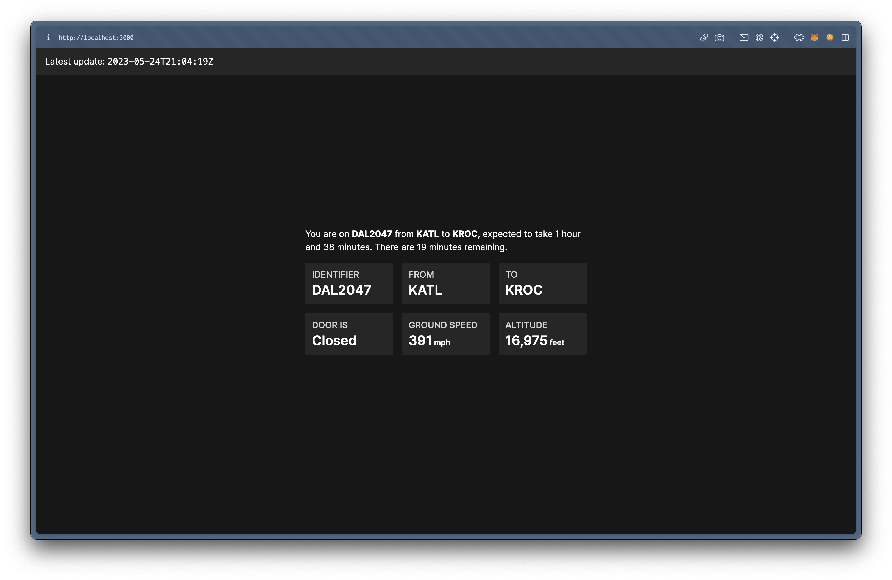

# delta-tracker

delta-tracker allows you to view real-time statistics while onboard a Delta flight. I was bored on my flight today, wanted to see what font Delta was using on the wifi portal and then ended up finding the API endpoint for flight stats. 30 minutes later I ended up with the following.

- It should be noted that this will only work while _on_ a Delta flight. Delta proxies `wifi.delta.com` _somewhere_, and that _somewhere_ is doing some magic to return flight data specifically based on that internet connection. My guess is that the API endpoint is either proxied to some computer system onboard the aircraft, or the aircraft is pinging a server over a socket connection.

TBH I wish the Delta API returned more data than it does. Next time I'm on a flight I might try to combine this with an API that can provide more data like [Flightaware](https://flightaware.com).

## Screenshot

